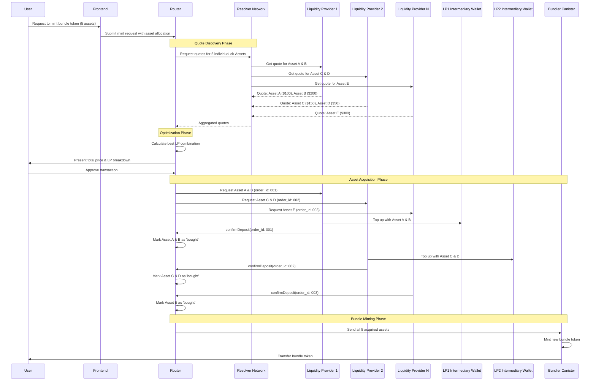
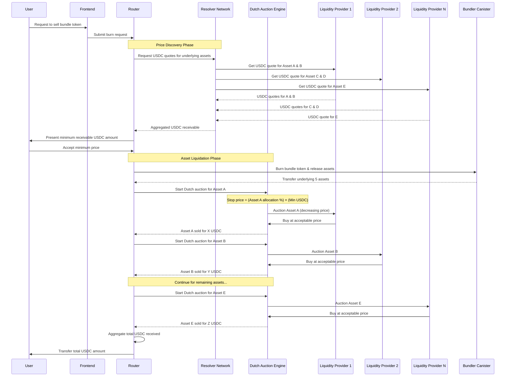

# XFusion Token Bundling Architecture

## Overview

XFusion implements a sophisticated Chain-Key token bundling system that allows users to mint and burn index tokens representing diversified portfolios of underlying assets. The system uses a resolver network of semi-centralized liquidity providers to ensure optimal pricing and liquidity.

## Core Components

- **User Interface**: Frontend for bundle creation and trading
- **Bundler Canister**: Main smart contract managing bundle tokens
- **Resolver Network**: Semi-centralized network of automated software for liquidity providers
- **Router**: Intelligent routing system for optimal LP selection
- **Liquidity Providers (LPs)**: Entities providing liquidity for individual ck-Assets
- **Intermediary Wallets**: LP-controlled wallets with pre-approved allowances

---

## Process 1: Minting Bundle Tokens (Buying)

### Scenario: User wants to mint 1 bundle token containing 5 underlying assets

### Detailed Steps:

1. **User Initiation**: User selects desired bundle composition (5 tokens with specific allocations)

2. **Quote Discovery**: 
   - Router queries resolver network for individual ck-Asset prices
   - Multiple LPs provide competitive quotes for different assets
   - Router receives aggregated pricing data

3. **Route Optimization**:
   - Router calculates optimal combination of LPs to minimize cost
   - Considers factors: price, liquidity depth, LP reliability
   - Presents final quote to user

4. **Asset Acquisition**:
   - Router distributes purchase orders to selected LPs
   - Each LP must have intermediary wallet with pre-approved allowances
   - LPs top up wallets and confirm deposits with unique order IDs
   - Router tracks completion status for each asset

5. **Bundle Minting**:
   - Once all assets are acquired, router transfers them to bundler canister
   - Bundler canister mints new bundle token representing the portfolio
   - Bundle token is transferred to user's account

---

## Process 2: Burning Bundle Tokens (Selling)

### Scenario: User wants to sell 1 bundle token and receive USDC

### Detailed Steps:

1. **Sell Request**: User initiates sale of bundle token for USDC

2. **Price Discovery**:
   - Router queries resolver network for current USDC value of each underlying asset
   - Multiple LPs provide competitive buy quotes
   - Router calculates minimum receivable USDC amount

3. **User Acceptance**: User reviews and accepts minimum receivable price

4. **Bundle Burning**:
   - Router instructs bundler canister to burn the bundle token
   - Bundler canister releases the 5 underlying assets to router

5. **Dutch Auction Liquidation**:
   - Router initiates Dutch auctions for each asset individually
   - Stop price for each auction = (Asset allocation %) × (Minimum USDC)
   - Auctions start high and decrease until LPs bid
   - Each asset is sold to highest bidder above stop price

6. **USDC Distribution**: Router aggregates all USDC received and transfers to user

---

## Key Architecture Benefits

### For Minting (Buying):
- **Competitive Pricing**: Multiple LPs compete for each asset
- **Optimal Routing**: Router selects best LP combination
- **Atomic Execution**: All assets must be acquired before minting
- **Transparency**: Clear order tracking and confirmation system

### For Burning (Selling):
- **Price Protection**: Minimum receivable price protects users
- **Market Efficiency**: Dutch auctions discover fair market prices
- **Proportional Liquidation**: Stop prices reflect asset allocations
- **Immediate Settlement**: USDC received upon completion

### For Liquidity Providers:
- **Flexible Participation**: LPs can provide liquidity for specific assets
- **Risk Management**: Intermediary wallets with controlled allowances
- **Competitive Environment**: Quote-based selection process
- **Clear Settlement**: Confirmed deposit system with order IDs

### For the Ecosystem:
- **Decentralized Liquidity**: No single point of failure
- **Efficient Price Discovery**: Market-driven pricing through competition
- **Scalable Architecture**: Can handle multiple simultaneous transactions
- **Transparent Operations**: All transactions recorded on-chain
