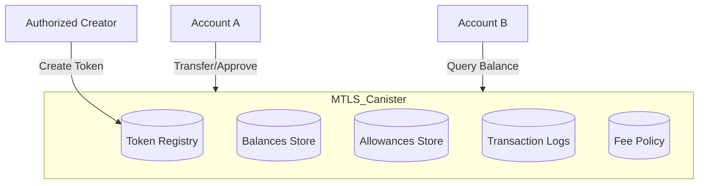
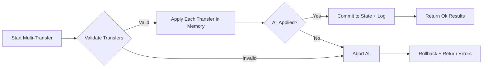
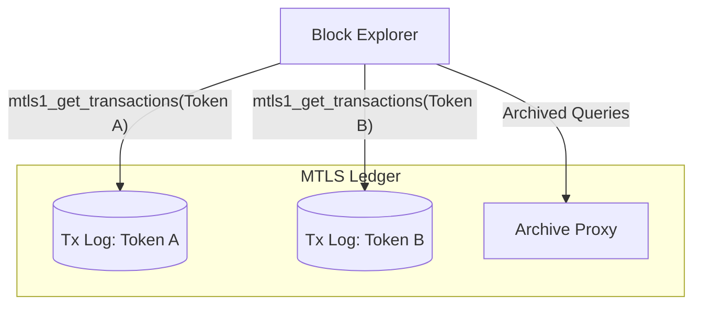
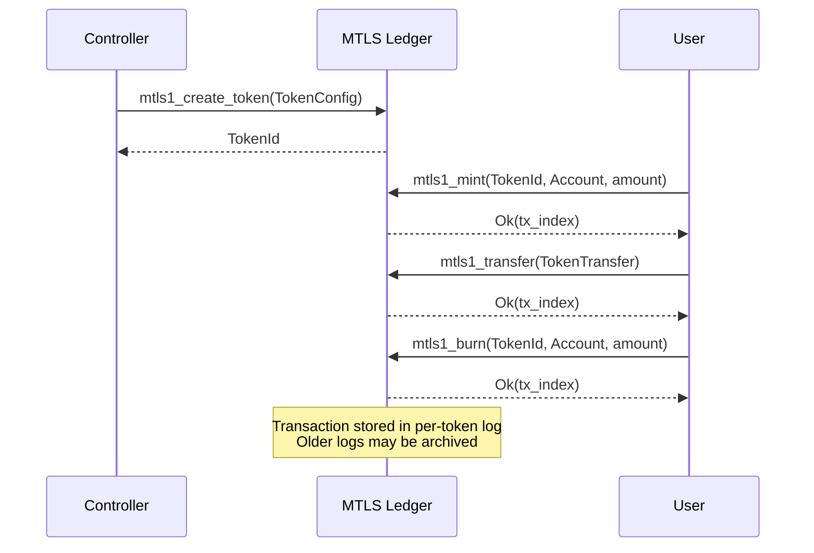

# MTLS: Multi-Token Ledger Standard

## Abstract

MTLS (Multi-Token Ledger Standard) is a standard for managing multiple fungible tokens within a single canister on the [Internet Computer](https://internetcomputer.org). Unlike ICRC tokens, which follow a "one token per canister" model, MTLS enables efficient multi-token operations, batch transfers, and shared infrastructure.

## Motivation

ICRC standards require deploying separate canisters for each token, leading to:

- **High deployment costs**: Each token requires its own canister and cycles  
- **Complex multi-token operations**: Multi-token transfers require multiple inter-canister calls  
- **Fragmented liquidity**: Each token operates in isolation  
- **Operational overhead**: Managing multiple canisters for related tokens  

MTLS addresses these limitations by enabling:

- **Cost efficiency**: Single canister deployment for multiple tokens  
- **Atomic operations**: Multi-token transfers and batch operations in single calls  
- **Shared infrastructure**: Common allowance and approval systems  
- **Simplified management**: Unified token lifecycle management  

## Architecture Overview



## Specification

> The keywords "MUST", "MUST NOT", "REQUIRED", "SHALL", "SHALL NOT", "SHOULD", "SHOULD NOT", "RECOMMENDED", "MAY", and "OPTIONAL" in this document are to be interpreted as described in RFC 2119.

**Canisters implementing the `MTLS-1` standard MUST implement all the functions in this interface.**

**MTLS-1 focuses exclusively on multi-token operations as a standalone paradigm.**

---

## Data Types

### TokenId

A `TokenId` uniquely identifies a token within the multi-token ledger.  

It MUST be a valid `principal`, derived using a canonical scheme:

```text
TokenId = principal(sha256(mtls_canister_principal || nonce))
```

- `nonce` is a strictly increasing counter maintained by the MTLS ledger.  
- Guarantees uniqueness and reproducibility.  

```candid "Type definitions" +=
type TokenId = principal;
```

### TokenConfig

```candid "Type definitions" +=
type TokenConfig = record {
    name : text;
    symbol : text;
    decimals : nat8;
    transfer_fee : nat;
    minting_account : Account;
    initial_supply : opt nat;
    max_supply : opt nat;
    metadata : vec record { text; Value };
};
```

### Account

```candid "Type definitions" +=
type Account = record {
    owner : principal;
    subaccount : opt blob;
};
```

### TokenTransfer

```candid "Type definitions" +=
type TokenTransfer = record {
    token_id : TokenId;
    from_subaccount : opt blob;
    to : Account;
    amount : nat;
    fee : opt nat;
    memo : opt blob;
    created_at_time : opt nat64;
};
```

---

## Core Methods

### mtls1_supported_tokens

```candid "Methods" +=
mtls1_supported_tokens : () -> (vec TokenId) query;
```

### mtls1_token_metadata

```candid "Methods" +=
mtls1_token_metadata : (TokenId) -> (opt vec record { text; Value }) query;
```

### mtls1_balance_of

```candid "Methods" +=
mtls1_balance_of : (TokenId, Account) -> (opt nat) query;
```

### mtls1_total_supply

```candid "Methods" +=
mtls1_total_supply : (TokenId) -> (opt nat) query;
```

### mtls1_transfer

```candid "Methods" +=
mtls1_transfer : (TokenTransfer) -> (variant { Ok : nat; Err : TransferError });
```

### mtls1_create_token

```candid "Type definitions" +=
type CreateTokenError = variant {
    Unauthorized;
    TokenAlreadyExists;
    InvalidConfig : record { reason : text };
    TemporarilyUnavailable;
    GenericError : record { error_code : nat; message : text };
};
```

```candid "Methods" +=
mtls1_create_token : (TokenConfig) -> (variant { Ok : TokenId; Err : CreateTokenError });
```

---

## Lifecycle Methods

### mtls1_mint

```candid "Methods" +=
mtls1_mint : (TokenId, Account, nat) -> (variant { Ok : nat; Err : MTLSError });
```

### mtls1_burn

```candid "Methods" +=
mtls1_burn : (TokenId, Account, nat) -> (variant { Ok : nat; Err : MTLSError });
```

### mtls1_update_token_metadata

```candid "Methods" +=
mtls1_update_token_metadata : (TokenId, vec record { text; Value }) -> (variant { Ok; Err : MTLSError });
```

---

## Advanced Methods

### mtls1_multi_transfer

```candid "Methods" +=
mtls1_multi_transfer : (vec TokenTransfer) -> (vec variant { Ok : nat; Err : TransferError });
```

#### Multi-Transfer Atomicity



---

## Approval Operations

### mtls1_approve

```candid "Type definitions" +=
type TokenApproveArgs = record {
    token_id : TokenId;
    from_subaccount : opt blob;
    spender : Account;
    amount : nat;
    expected_allowance : opt nat;
    expires_at : opt nat64;
    fee : opt nat;
    memo : opt blob;
    created_at_time : opt nat64;
};
```

```candid "Methods" +=
mtls1_approve : (TokenApproveArgs) -> (variant { Ok : nat; Err : ApproveError });
```

### mtls1_transfer_from

```candid "Type definitions" +=
type TokenTransferFromArgs = record {
    token_id : TokenId;
    spender_subaccount : opt blob;
    from : Account;
    to : Account;
    amount : nat;
    fee : opt nat;
    memo : opt blob;
    created_at_time : opt nat64;
};
```

```candid "Methods" +=
mtls1_transfer_from : (TokenTransferFromArgs) -> (variant { Ok : nat; Err : TransferFromError });
```

### mtls1_allowance

```candid "Methods" +=
mtls1_allowance : (TokenId, record { account : Account; spender : Account }) -> (opt Allowance) query;
```

---

## Fee Policy

```candid "Type definitions" +=
type FeePolicy = variant {
  Burn;
  MintingAccount;
  Treasury : Account;
};
```

```candid "Methods" +=
mtls1_fee_policy : (TokenId) -> (FeePolicy) query;
```

---

## Transaction Schema

MTLS-1 extends [ICRC-3](../ICRC-3/README.md) with token-aware transactions.

```candid "Type definitions" +=
type Transaction = record {
    token_id : TokenId;
    operation : variant { Mint; Burn; Transfer; Approve; TransferFrom; CreateToken; UpdateMetadata };
    from : opt Account;
    to : opt Account;
    spender : opt Account;
    amount : nat;
    fee : opt nat;
    memo : opt blob;
    timestamp : nat64;
    tx_index : nat;
};
```

### Log Access

```candid
public query func mtls1_get_transactions(token_id : TokenId, start : Nat, length : Nat) : async [Transaction];
public query func mtls1_get_transaction_count(token_id : TokenId) : async Nat;
```

**Archive Delegation**:  
Ledger canisters MUST proxy transaction queries to archive canisters (like ICRC-3). Clients SHOULD only call the main ledger.

#### Transaction Log Model



---

## Token Lifecycle



---

## Security Considerations

- Each token MUST have isolated state (balances, allowances, logs, fees).  
- Multi-transfer MUST be atomic (all succeed or all fail).  
- Lifecycle ops MUST respect per-token minting_account authorization.  

---

## Metadata

| Key | Semantics | Example |
|-----|-----------|---------|
| `mtls1:version` | Standard version | `variant { Text = "1.0.0" }` |
| `mtls1:total_tokens` | Total number of tokens | `variant { Nat = 5 }` |
| `mtls1:batch_transfers` | Batch transfer support | `variant { Text = "true" }` |

---

## Examples

### Create Token

```javascript
await actor.mtls1_create_token({
  name: "Example Token",
  symbol: "EXT",
  decimals: 8,
  transfer_fee: 10000,
  minting_account: { owner: principal, subaccount: null },
  initial_supply: [1000000000],
  max_supply: null,
  metadata: []
});
```

### Multi-Transfer

```javascript
await actor.mtls1_multi_transfer([
  { token_id: tokenA, to: { owner: recipient, subaccount: null }, amount: 1_000_000, from_subaccount: null, fee: null, memo: null, created_at_time: null },
  { token_id: tokenB, to: { owner: recipient, subaccount: null }, amount: 500_000, from_subaccount: null, fee: null, memo: null, created_at_time: null }
]);
```

---

## References

- [Internet Computer Principal Encoding](https://internetcomputer.org/docs/references/id-encoding-spec)  
- [ICRC-1: Base Fungible Token Standard](https://github.com/dfinity/ICRC-1/tree/main/standards/ICRC-1/README.md)  
- [ICRC-2: Approve and Transfer From](https://github.com/dfinity/ICRC-1/tree/main/standards/ICRC-2/README.md)  
- [ICRC-3: Block Log](../ICRC-3/README.md)  
